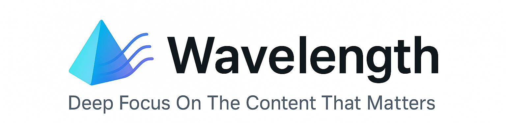

<picture>
  <source media="(prefers-color-scheme: dark)" srcset="./assets/logo-dark.png">
  <source media="(prefers-color-scheme: light)" srcset="./assets/logo-light.png">
  
</picture>

<h1 align="left">Wavelength: Deep Focus On The Content That Matters</h1>

Tired of jumping between apps to track subscribed creators only to discover irrelevant content? Stop the endless scroll! Wavelength gathers your favorite subscriptions in one place, filtering out the noise using AI and serving up only the content that matches your wavelength.

## Don't TLDR: Obsession with depth and quality

In the era of information overflow and "GPT, summarize this for me", I still believe in the value of watching long videos, listening to long podcasts, and reading long articles because:
1. **Context matters** (experience has taught me that context-less takeaways are meaningless)
2. I want to pay respect to creators who thoughtfully produced the whole content

Wavelength helps answer the "how should I spend my free time" question, without overwhelming myself with exhaustive updates on world events as if I require presidential-level briefings.

For broader information needs, open-source projects like [Folo](https://github.com/RSSNext/Folo) or [Meridian](https://github.com/iliane5/meridian) that focus on the "recall" and "timeliness" aspects of information, and curated digests like [TLDR newsletter](https://tldr.tech/) (one of my favorites) offering byte-sized themed summaries are better choices. Wavelength is not about substituting these channels but complementing them.

In Wavelength, I made a conscious choice not to build tldr-over-tldr (name inspired by FOF, or [Fund of Funds](https://en.wikipedia.org/wiki/Fund_of_funds)). Instead, this project sources quality content directly from original publishers.

## Key program flow (as a daily Github Action)
* Search daily for new content from the provided subscription list
* Given user preferences, sort new updates into must-see, might-be-interested, and you-may-skip categories
* Generate Daily Digest in Notion

## Demo of the daily digests

## Supported Platforms

Media | Platform | Connector
-|-|-|
Audio | Apple Podcast | API (iTunes search)
Video | Youtube | API (data API, captions not available, need OAuth2)
Video | Bilibili | API (recArchivesByKeywords)
Text | 36Kr | Website through requests or playwright

## Known Limitations
| Platform | Limitations |
|-|-|
| Podcast | Some podcasts have episodes that are only released to paid customers; these contents may be missing from their RSS feed |
| Bilibili | Current API doesn't return video descriptions, nor does it classify subscriber-only videos (充电专属) |
| WeChat Public Account | I didn't include WeChat despite its dominance in creator economy. WeChat implements extreme measures to prevent programmatic access to its contents. One could possibly consult [wewe-rss](https://github.com/cooderl/wewe-rss) for inspiration on how to take some extra detours to gain access |

## Developer's notes

### Towards a universal, abstracted website access pattern

As one of the key areas seeing noticeable advancement with the rise of agents, many companies and startups are developing high-level abstractions of website/internet interactions so agents can operate the web with natural language instructions. Notably, [Browser-use](https://github.com/browser-use/browser-use), [Stagehand](https://www.stagehand.dev/), and [playwright-mcp](https://github.com/microsoft/playwright-mcp) have great potential to simplify the current highly engineered website crawlers (built for each unique domain) into an AI-native stack.

### Towards multi-media understanding
Current textual-based descriptions of subscribed contents are sourced from the creators themselves, often as part of the received metadata. However, for multimedia contents like podcasts or videos, descriptions/summaries can be directly generated through multimedia consumption. Google recently released [Gemini video understanding](https://developers.googleblog.com/en/gemini-2-5-video-understanding/), which seems like an affordable way to explore generating summaries directly from YouTube videos themselves, not to mention that some presentation-heavy videos have captions already.

### Website -> Markdown conversion
To extract meaningful semi-structured information from HTML, one may choose to pre-process website content and convert to markdown to (1) trim out the noise while (2) retaining a hierarchical document format. There are several OSS libraries for this:

| OSS Lib | Comments |
|---------|----------|
| [markitdown](https://github.com/microsoft/markitdown) | Released by Microsoft in Mar 2024, boasted to be a universal converter for multi-media. Its HTML -> markdown functionality seems to leverage `markdownify`. |
| [markdownify](https://github.com/matthewwithanm/python-markdownify) | A popular python package, actively maintained. | 
| [trafilatura](https://github.com/adbar/trafilatura) | Similar to markdownify, also well-maintained. | 

For website processing, I ended up **not using** any of these parsers but developed customized Beautiful Soup-based solutions. If I can obtain the precise structure of the HTML document and the effort to build a customized parser is low (given how AI can write highly customized code in minutes), I believe the benefits of a generalizable solution are outweighed by better results.

### ListenNotes: a 3rd-party universal podcast search API
While Apple Podcast coverage is arguably comprehensive, I noticed a third-party API offered by [ListenNotes](https://www.listennotes.com/) which provides cleaner and standardized return formats.

### IP-level blocking
Notably, all Substack-related services have implemented IP-level blocking, and current workflows in GitHub Actions are blocked from accessing them.

## Future Works
- Add a logo
- Add llm generated reason to daily digest
- Test agent-based solutions like playwright-mcp for easier website access
- Test Gemini's YouTube video understanding feature
- Add new website trackers for: a16z, Sequoia, Substack, etc.
- Add rate limiting for each connector
- Migrate to another hosting solution to avoid IP-level blocking

## Completely vibe coded
This project is entirely vibe coded through [Cursor](https://cursor.sh).
